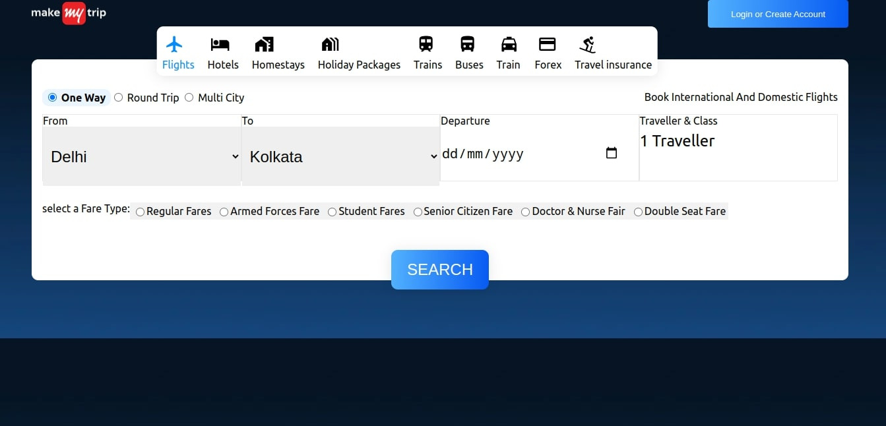
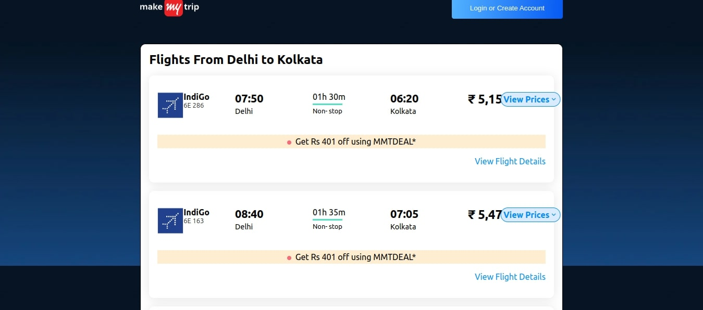

# Telaverge Clone Assignment

In this assignment, we are working on a MMT Clone project, which involves building a REST API model and a frontend application.

## REST API Model

To get started with the REST API model, follow these steps:

### Backend Setup

1. Navigate to the `RestApi` directory using the terminal:
   ```shell
   cd RestApi
   ```

2. Install the necessary dependencies:
   ```shell
   npm install
   ```

3. Start the backend server:
   ```shell
   npm start
   ```

## Frontend Application

To run the frontend application, follow these steps:

### Frontend Setup

1. Navigate to the `reactapp` directory using the terminal:
   ```shell
   cd reactapp
   ```

2. Install the required dependencies:
   ```shell
   npm install
   ```

3. Start the frontend application:
   ```shell
   npm start
   ```

### App Screenshots

Here are some screenshots of the MMT Clone application for your reference:

**Landing Page:**  

  

**Search Page:**  

  

